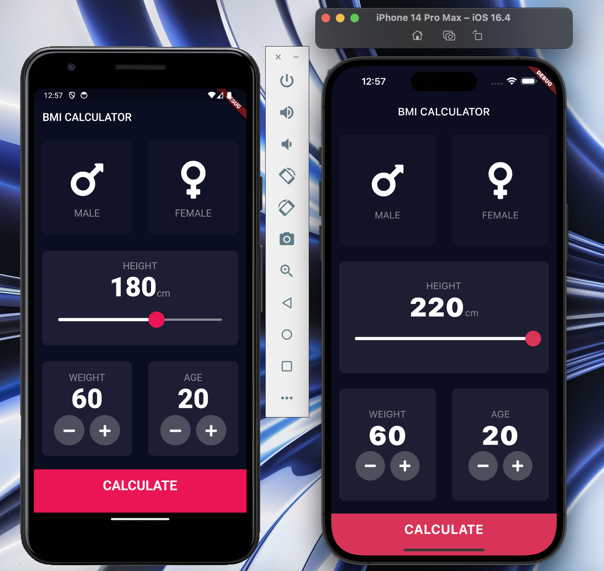
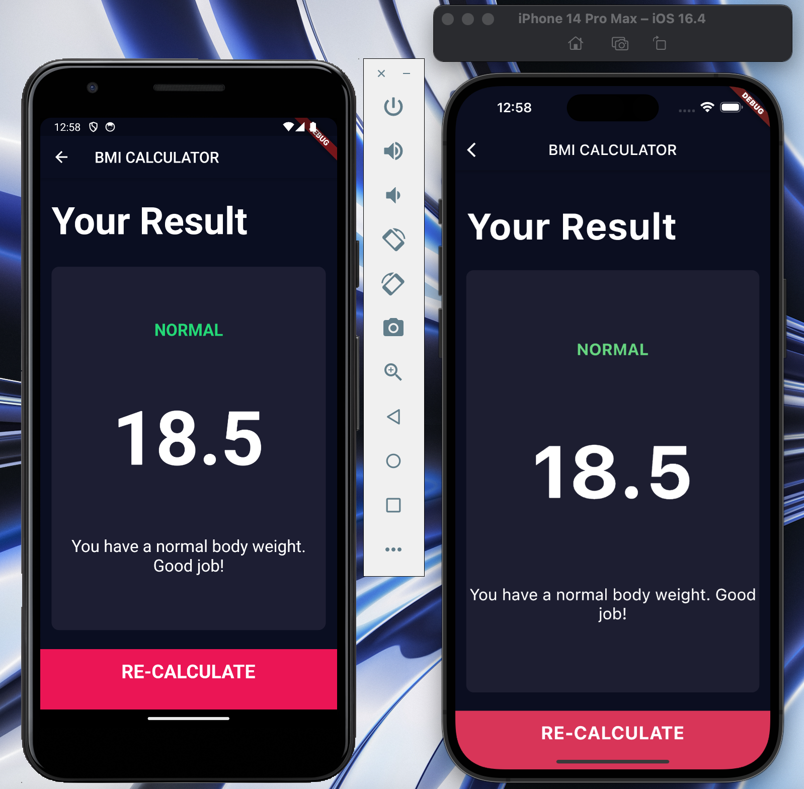

# BMI Calculator

A BMI calculator app for both iOs and Android. Inspiration: [Ruben Vaalt](https://dribbble.com/shots/4585382-Simple-BMI-Calculator) and The App Brewery

## Setup

Install [fvm](https://fvm.app/docs/getting_started/installation) and then through fvm, install Flutter SDK 2.2.2.

NOTE: After installing fvm and installing Flutter SDK 2.2.2, use `fvm flutter run` to run the app instead of the default command

## Images of the app

